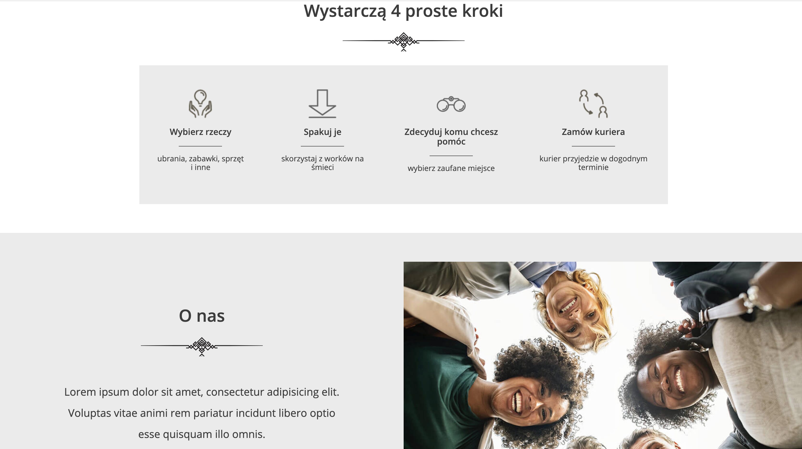
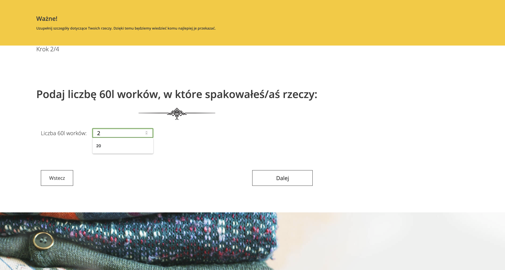
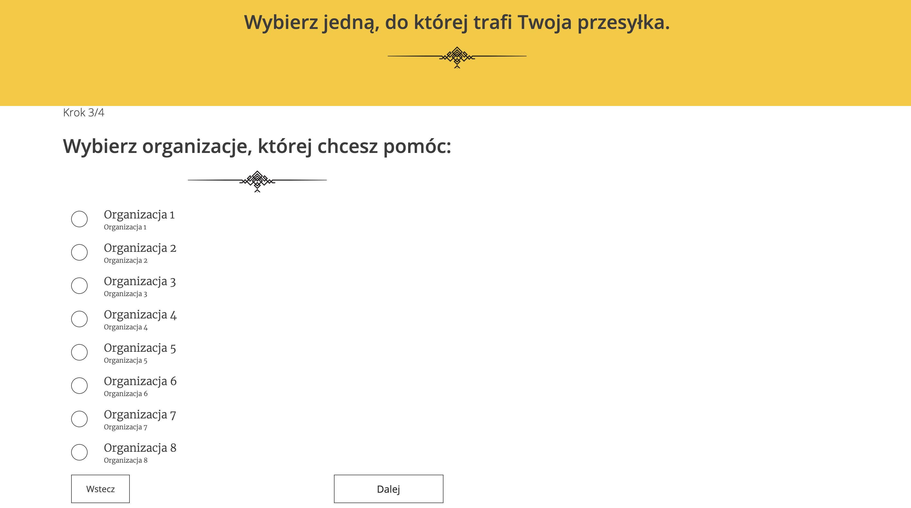
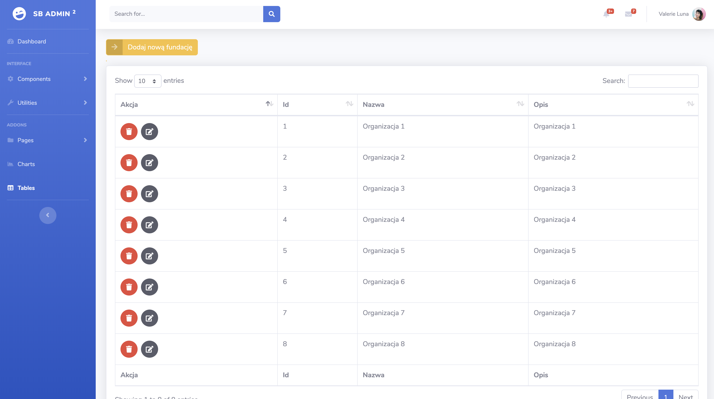

# Charity
Application is developed for giving donations like a clothes, RTV, AGD, Books for Intitutions. 
Application contains many Entities like donation, institution, categories, user which are connected to each other. 
Application has divided content which is split on the one for regular user or admin.

# Technologies
Application is developed with technologies like:
- SpringBoot
- Spring MVC
- Spring Security
- MySQL,
- Hibernate,
- JavaScript
- HTML 5

Admin panel

